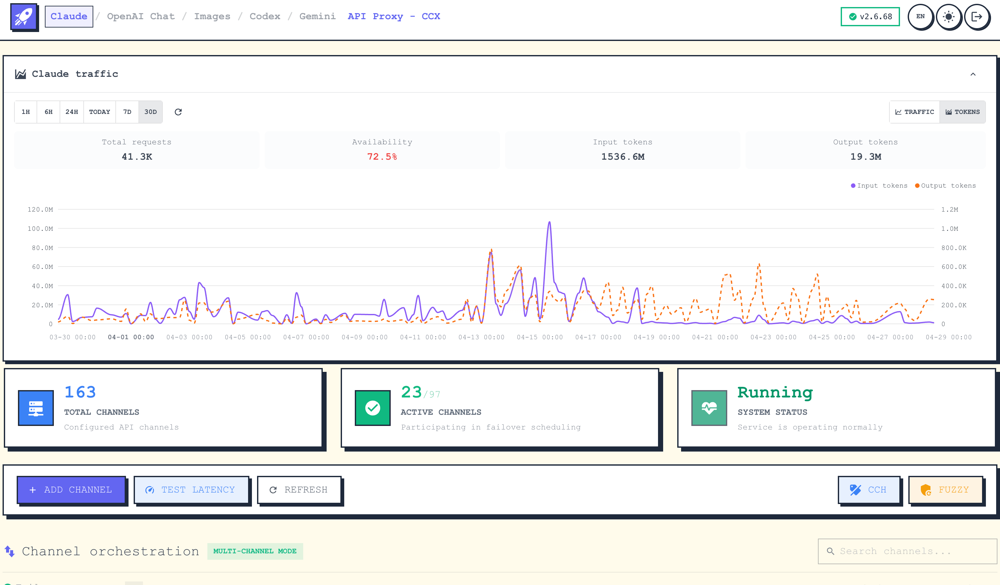
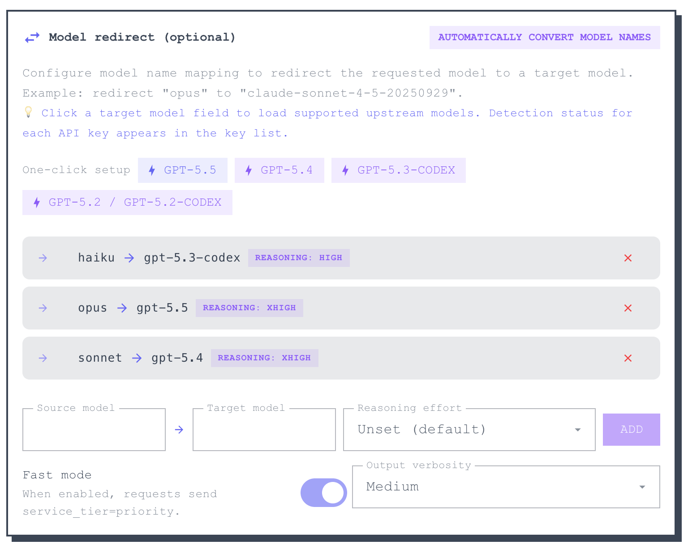
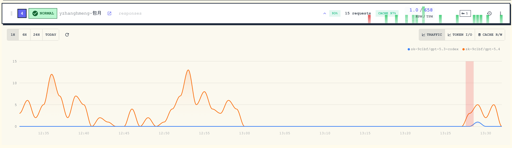

# Claude / OpenAI Chat / OpenAI Images / Codex Responses / Gemini API Proxy - CCX

English | [简体中文](README.zh-CN.md)

[](https://github.com/BenedictKing/ccx/releases/latest)
[](https://opensource.org/licenses/MIT)

CCX is a high-performance AI API proxy and protocol translation gateway for Claude, OpenAI Chat, OpenAI Images, Codex Responses, and Gemini. It provides a unified entrypoint, built-in web administration, channel orchestration, failover, multi-key management, and model routing.

## Features

- Integrated backend + frontend architecture with single-port deployment
- Dual-key authentication with `PROXY_ACCESS_KEY` and optional `ADMIN_ACCESS_KEY`
- Web admin console for channel management, testing, logs, and monitoring
- Support for Claude Messages, OpenAI Chat Completions, OpenAI Images, Codex Responses, and Gemini APIs
- Smart scheduling with priorities, promotion windows, health checks, failover, and circuit recovery
- Per-channel API key rotation, proxy support, custom headers, model allowlists, and route prefixes
- Responses session tracking for multi-turn workflows
- Embedded frontend assets for simple binary deployment

## Screenshots

### Channel Orchestration

Visual channel management with drag-and-drop priority adjustment and real-time health monitoring.



### Add Channel

Supports multiple upstream service types and flexible API key, model mapping, and request parameter configuration.



### Traffic Stats

Real-time monitoring of per-channel request traffic, success rate, and latency.



## Architecture

CCX exposes one backend entrypoint:

```text
Client -> backend :3000 ->
  |- /                            -> Web UI
  |- /api/*                       -> Admin API
  |- /v1/messages                 -> Claude Messages proxy
  |- /v1/chat/completions         -> OpenAI Chat proxy
  |- /v1/responses                -> Codex Responses proxy
  |- /v1/images/{...}             -> OpenAI Images proxy
  |- /v1/models                   -> Models API
  `- /v1beta/models/*             -> Gemini proxy
```

Images endpoints currently include:
- `POST /v1/images/generations`
- `POST /v1/images/edits`
- `POST /v1/images/variations`

See [ARCHITECTURE.md](ARCHITECTURE.md) for the detailed design.

## Quick Start

### Option 1: Binary

1. Download the latest binary from [Releases](https://github.com/BenedictKing/ccx/releases/latest)
2. Create a `.env` file next to the binary:

```bash
PROXY_ACCESS_KEY=your-proxy-access-key
PORT=3000
ENABLE_WEB_UI=true
APP_UI_LANGUAGE=en
```

3. Run the binary and open `http://localhost:3000`

### Option 2: Docker

```bash
docker run -d \
  --name ccx \
  -p 3000:3000 \
  -e PROXY_ACCESS_KEY=your-proxy-access-key \
  -e APP_UI_LANGUAGE=en \
  -v $(pwd)/.config:/app/.config \
  crpi-i19l8zl0ugidq97v.cn-hangzhou.personal.cr.aliyuncs.com/bene/ccx:latest
```

### Option 3: Build From Source

```bash
git clone https://github.com/BenedictKing/ccx
cd ccx
cp backend-go/.env.example backend-go/.env
make run
```

Useful commands:

```bash
make dev
make run
make build
make frontend-dev
```

## Core Environment Variables

```bash
PORT=3000
ENV=production
ENABLE_WEB_UI=true
PROXY_ACCESS_KEY=your-proxy-access-key
ADMIN_ACCESS_KEY=your-admin-secret-key
APP_UI_LANGUAGE=en
LOG_LEVEL=info
REQUEST_TIMEOUT=300000
```

## Main Endpoints

- Web UI: `GET /`
- Health: `GET /health`
- Admin API: `/api/*`
- Claude Messages: `POST /v1/messages`
- OpenAI Chat: `POST /v1/chat/completions`
- Codex Responses: `POST /v1/responses`
- OpenAI Images: `POST /v1/images/generations`, `POST /v1/images/edits`, `POST /v1/images/variations`
- Gemini: `POST /v1beta/models/{model}:generateContent`
- Models API: `GET /v1/models`

## Development

Recommended local workflow:

```bash
make dev
```

Frontend only:

```bash
cd "frontend"
bun install
bun run dev
```

Backend only:

```bash
cd "backend-go"
make dev
```

## Additional Docs

- [README.zh-CN.md](README.zh-CN.md)
- [backend-go/README.md](backend-go/README.md)
- [ARCHITECTURE.md](ARCHITECTURE.md)
- [DEVELOPMENT.md](DEVELOPMENT.md)
- [ENVIRONMENT.md](ENVIRONMENT.md)
- [RELEASE.md](RELEASE.md)

## Community

Join the QQ group for discussion: **642217364**


## License

MIT
